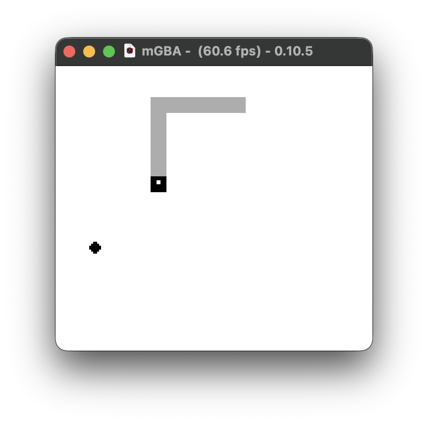

# mrbz - Ruby on Game Boy

A minimal Ruby virtual machine that runs mruby bytecode on Game Boy hardware. Includes a playable Snake game written in Ruby.



## About

This project was inspired by [mrubyz](https://github.com/yujiyokoo/mrubyz), a minimal mruby VM for Z80, most notably - Sega Master System. mrbz adapts and extends this concept for the Game Boy platform.

The VM interprets mruby bytecode compiled by `mrbc`, enabling Ruby code to run on original Game Boy hardware (or emulators).

## Features

- **mruby bytecode interpreter** with ~50 opcodes
- **Symbol table parsing** from bytecode for proper method dispatch
- **Instance variables** (`@snake_x`, `@direction`, etc.)
- **Arrays** with dynamic indexing
- **Arithmetic and comparisons** (`+`, `-`, `*`, `/`, `==`, `<`, `>`, etc.)
- **Control flow** (`if`/`else`, `while` loops)
- **Built-in functions** for Game Boy hardware:
  - `read_joypad` - D-pad input
  - `draw_tile` / `clear_tile` - Background tile manipulation
  - `wait_vbl` - VBlank synchronization
  - `rand` - Random number generation
  - `game_over` - End game with score display

## Building

### Requirements

- [GBDK-2020](https://github.com/gbdk-2020/gbdk-2020/releases) - Game Boy Development Kit
- [mruby](https://mruby.org/) - For the `mrbc` bytecode compiler (`brew install mruby` on macOS)
- [mGBA](https://mgba.io/) or another Game Boy emulator

### Setup

1. Install GBDK-2020 to `~/gbdk` (or update `GBDK_HOME` in Makefile)
2. Install mruby for the `mrbc` compiler

### Build & Run

```bash
# Build the Snake game ROM
make snake.gb

# Run in mGBA
make run

# Or manually
open -a mGBA snake.gb
```

## How It Works

```
snake.rb (Ruby source)
       │
       ▼ mrbc (mruby compiler)
  Bytecode (.ruby.c)
       │
       ▼ GBDK compiler
  mrbz VM + bytecode
       │
       ▼
  Game Boy ROM (.gb)
```

The Ruby code is compiled to mruby bytecode, which is embedded as a C array. The mrbz VM interprets this bytecode at runtime on the Game Boy.

## Project Structure

```
src/
├── mrbz/           # Ruby VM core
│   ├── vm.c        # Bytecode interpreter
│   ├── vm.h        # VM structures and macros
│   ├── opcodes.h   # Opcode definitions
│   └── builtins.c  # Built-in function dispatch
├── gb/             # Game Boy platform layer
│   ├── main.c      # Entry point
│   ├── platform.c  # Hardware abstraction
│   ├── platform.h  # Platform API
│   └── tiles.c     # Tile graphics
└── game/           # Game code
    └── snake.rb    # Snake game in Ruby
```

## The Snake Game

The Snake game (`src/game/snake.rb`) is ~200 lines of Ruby:

- Use **D-pad** to change direction
- Eat food (dots) to grow and score points
- Avoid walls and your own tail
- Game ends on collision, showing your score

## Limitations

This is a minimal VM designed for simple games:

- No classes or objects (top-level code only)
- No strings (symbols and integers only)
- No floats (integer arithmetic only)
- No garbage collection (static memory allocation)
- Limited array count and size
- No method definitions (built-ins only)

## License

MIT
